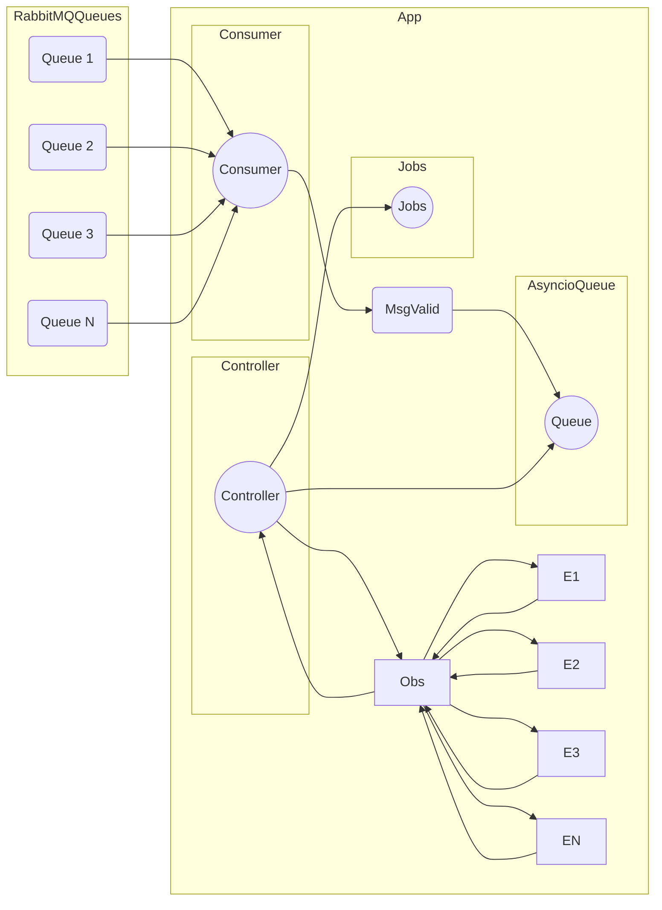

# ingestors-file-downloader

Project description here.

## Running
 ```sh
make logs
 ```

Fake Data
```json
{
  "data": {
    "reference": {
      "year": 2023,
      "month": 8,
      "day": 23
    }
  },
  "metadata": {
    "jobId": "job_id",
    "processingDate": "2023-07-25T20:05:10Z"
  }
}
```

## Diagram


